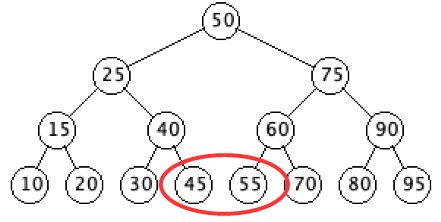
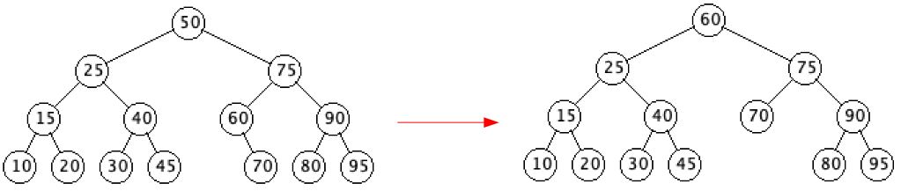

# Deleting Nodes

`deleteNode(Node z)`

When nodes are deleted, the resulting tree nedds to maintain the subtree key ordering, such that we still have a BST satisfying the convention used to construct it.

**Note:** The order in which nodes are deleted will also effect the tree structure.

## Explanantion

- There are two functions associated with deleting a node
  - `deleteNode(Node z)`
    - Delete Node `z` from the tree
  - `shiftNode(Node u, Node v)`
    - Replace Node `u` with Node `v`
    - The function is used by `deleteNode`
    - You can find information on this implementation [here](Shift.md)
- There are three cases that our code needs to handle
  - `z` is a leaf
  - `z` has a single child
  - `z` has two children
- Removing a Node with no children (a leaf)
  - To remove a leaf, such as Node 45 or Node 55
    - We simply set the Node's parent's applicable child to null
    - To delete 45, since 45 has no children and it is the right child of 40, we set the right child of 40 to null
    - To delete 55, since 55 has no children and it is the left child of 60, we set the left child of 60 to null
  - The `deleteNode` function does the above indirectly through the `shiftNode` method
    - To delete 45, we do `shiftNode(z, z.getRight())`, `z = Node 45`
    - To delete 55, we do `shiftNode(z, z.getLeft())`, `z = Node 55`



- Removing a Node with one child
  - To remove a node with a single child, such as Node 40 or Node 60
    - We replace the node being deleted with it's only child
    - To delete 40, we set 25's right child to 30
      - Since everything in 25's right subtree is greater than 25, replacing node 40 with node 30 maintains the key relationships of the binary search tree
    - To delete 60, we set 75's left child to 70
      - Since everything in 75's left subtree is less than 75, replacing node 60 with node 70 maintains the key relationships of the binary search tree      


  - To delete 40, we set 25's right child to 30
     - This is done indirectly via `shiftNode(z, z.getLeft())`, `z = Node 40`
  - To delete 60, we set 75's left child to 70
     - This is done indirectly via `shiftNode(z, z.getRight())`, `z = Node 60`
     - Be sure to look at [shiftNode](Shift.md) for implementation details of `shiftNode()`
- Removing a Node with two children
  - The node that is being removed, `z`, will be replaced by it's successor
    - There are two cases
      - `z`'s successor is not it's right child
        - This mean that `z`'s right child has a left child
        - `z`'s successor has no left child, so we replace it with it's right child, and then replace `z` by it's successor
      - `z`'s successor is it's right child
        - This means that `z`'s right child has no left child, and it can directly replace `z`
  - We are going to delete Node 50
    - It's successor is 75
    - Since 75 is 50's right child, 75 has no left child, and so it can directly replace 50


  - We are going to delete Node 50
    - It's successor is 60
    - Since 60 is not 50's right child, we replace 60 with it's right child (60 has no left child), 70, and then replace 50 with 60
      - 60 cannot have a left child, since that would mean that 60 was not 50's successor



## Implementation

- `deleteNode(Node z)` pseudo code

``` java
if(z.getLeft() == null)					// if 0 or 1 children
    shiftNode(z, z.getRight())			// directly replace z with child
else
    if(z.getRight() == null)				// if 1 child
        shiftNode(z, z.getLeft())			// directly replace z with child
    else									// 2 children
        y = getSuccessor(z)				// get z's successor, y
        if( y.getParent() != z )			// y is not z's child
            shiftNode(y, y.getRight())	// replace y with right child
            y.setRight(z.getRight())		// update z's former right child
            y.getRight().setParent(y)	// update z's former right child
        shiftNode(z, y)					// replace z with y
        y.setLeft(z.getLeft())				// update z's former left child
        y.getLeft().setParent(y)			// update z's former left child
```
