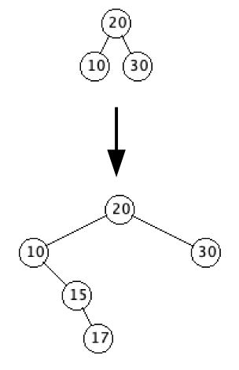
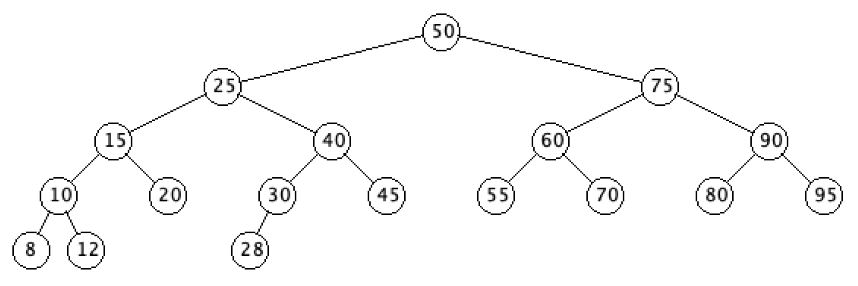
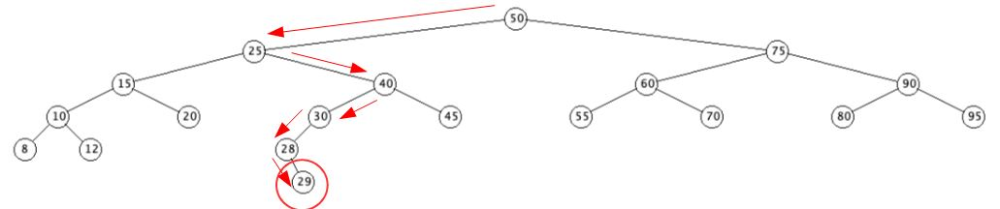

# Inserting Nodes

`insertNode(Node z)`

Nodes are added to the tree such that:
- all descendants within the left subtree's keys remain less than the subtree root's key
- all descendants within the right subtree's keys remain greater than the subtree root's key

The first node added to the tree becomes the ***root*** of our BST.
**Note:** The order in which nodes are added to the tree defines the tree structure.

## Adding a node to a BST

`public void insertNode(Node z)`

We will utilize two local `Node` variables, say `x` and `y`, to search for the correct place to insert `Node` `z`.

`x` is initialized to the root, `getRoot()`, and `y` to `null` (the parent of the root).

**Edge case:** 

Note, we don't use ```y = x.getParent()```. Why not?

Consider the case where `z` is the first `Node` being added to the BST.
Then `x` will be `null`, since the BST is empty.
Trying to define ```y = x.getParent();``` could thus cause a `NullPointerException` to be thrown, a runtime error.

Here's a snippet of the `insertNode()` function, showcasing how we do the traversal:

**Note the below snippet is pseudo-code** so it will not compile, although the conversion to real Java code is not difficult.

``` java
while (x != null) //...............................if x is null, y has an empty child for z
    y = x //.......................................y becomes x's parent
    if z.getKey() < x.getKey()
        x = x.getLeft() //  .......................update x to it's left child
    else
        x = x.getRight() //........................update x it it's right child
end while
z.setParent(y) //..................................set z's parent to y (x's parent)
if y == null
    setRoot(z) //..................................set the root to z
else if z.getKey() < y.getKey()
    y.setLeft(z) // ...............................update z's parent's left child to z
else
    y.setRight(z) // ..............................update z's parent's right child to z
```

## Notes on the insertNode() logic

When we exit the while loop:

**Edge case 1: Empty BST**

If this is the first `Node` added to our BST, then:
- both `x` and `y` will be `null`.
- Thus, `z` becomes the root of the tree.

**Case 2: Non-Empty BST**

If this is NOT the first `Node` added to our BST, then:
- `y` is `x`'s parent (and is not `null`)
- `x` is `null`
- The node `x`  is where we are going to put `z`
	- `x` is either the left or right child of `y`
- We set the parent of `z` to `y` (same as parent of `x`)
- We set `z` as the appropriate child of `y`
	- If `z`'s key < `y`'s key, then `z` becomes `y`'s left child.
	- If `z`'s key >= `y`'s key, then `z` becomes `y`'s right child.

**Example**

- Let's start with three nodes, having key values 20, 10, 30 (in that order)
- What should happen is
  - 20 becomes the root
  - 10 is added as 20s left child
  - 30 is added as 20s right child
- Now let's add key values 15 and 17 to the above
  - 15 is less than 20, but greater than 10, so it should become the right child of 10
  - And 17 is also less than 20, greater than 10, and greater than 15, so it should be the right child of 15   



- Let's trace through what happens when we insert the key 20
- Initially, the root node is null, so `x` and `y` are both null, and `z` is a new Node with just the key set to 20
- Since `x` is null, we immediately exit the while loop
- We then set `z.setParent(y)`, which is null
- We set the root of the tree to `z`, `setRoot(z)`, and exit
- And so, the first node that is added to any binary search tree becomes the root

**Example**

- Now let's create another binary search tree with key values 50, 25, 75, 15, 40, 60, 90, 10, 20, 30, 45, 55, 70, 80, 95, 8, 12, 28
- Let's trace through what happens when we add a new node to the above with a key of 29



- Adding 29
  - Initially
    - z = (29,,,)
    - x = (50,,25,75)
    - y = (,,,)
  - The first pass through the while loop gives us
    - y = (50,,25,75)
    - x = (25,50,15,40), since 29 < 50
  - The second pass through the while loop gives us
    - y =  (25,50,15,40)
    - x = (40,25,30,45), since 29 > 25
  - The third pass through the while loop gives us
    - y = (40,25,30,45)
    - x = (30,40,28,), since 29 < 40
  - The fourth pass through the while loop gives us
    - y = (30,40,28,)
    - x = (28,30,,), since 29 < 30
  - The fifth pass through the while loop gives us
    - y = (28,30,,)
    - x = (,,,), since 29 > 28
  - Since x is null, we exit the while loop
  - Set z's parent to y
    - z.setParent(y), y = (28,30,,)
    - z = (29,28,,)
  - Since z.getKey() > y.getKey(), we add z as the right child of y
    - y.setRight(z), z = (29,28,,))
    - y = (28,30,,29)
  - We finally get the tree below


