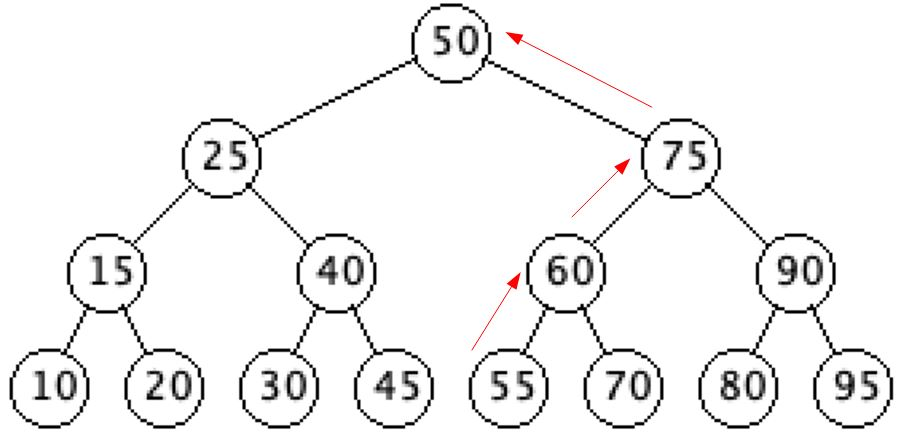

# Predecessor

`getPredecessor(Node x)`

This will return the node having the ***largest key value that is smaller than*** the specified node's key.
- In other words, it will return the node whose key is the ***greatest lower bound*** of the specified node's key.

**Note:** The node with the smallest key value has a null predecessor.

## Implementation

- The predecessor function returns the "previous" node in the tree
  - That is, the Node with the largest key that is less than the Node's key value
    - The basic idea is
      - If the Node has a left child, then return the maximum Node of the left subtree
      - If the Node does not have a left child, then return the first ancestor of x in which x is in the Node's right subtree
        - This will be the first Node that has a key less than x's

``` java
getPredecessor(Node x)
    if(x.getLeft() != null)
    return getMax(x.getLeft())
    y = x.getParent()
    while((y != null) and (x == y.getLeft())) // we either trace back to the
        x = y // ................................root of the tree or to the
        y = y.getParent() // ....................first ancestor of x that
    return y //..................................has x in it's right subtree
```

### Explanation

- So, how do we know this works, there are two cases
  - `x` has a left child or left subtree
  - `x` does not have a left child or left subtree
  - The `getPredecessor()` function is symmetric to the `getSucccessor()` function, swapping left/right and less than/greater than
- Predecessor of 50
  - Since 50 has a left child, we simple return the max of it's left subtree


- Predecessor of 10
  - Since 10 is the min Node, the while loop will exit when x becomes the root and y becomes null


- Predecessor of 55
  - The first ancestor of 55 in which 55 is in the right subtree is 50



- Trace of predecessor of 55
  - First pass of while loop
    - x = 55 (left child of y)
    - y = 60
  - Second pass of while loop
    - x = 60 (left child of y)
    - y = 75
  - Third pass of while loop
    - x = 75 (right child of y)
    - y = 50
  - Exit while loop and return y = 50
