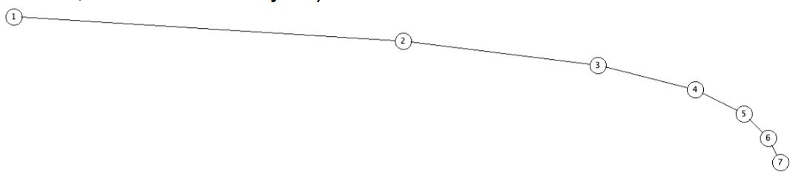
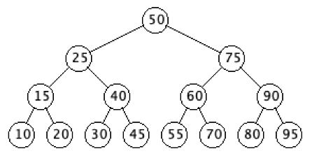
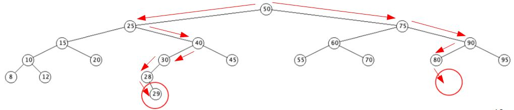

# Searching

`getNode(Node x, int key)`

This function will find and return the node that has a key value ***matching*** the key passed to the function.
- Node x specifies which node from which to start the search.

## Background

**General Considerations about trees and search**

- The tree only has one point of access--the root.
- Nodes can only be reached from the root by following the edges.
- If a Node is no longer a left or right subchild, it is unreachable
- Recursive algorithms that modify the links in the tree must be done very carefully


- Storing nodes in a search tree should be done to make `getNode` as efficient as possible.
- If a tree has all its Node stored on one long branch and there are `n` Nodes then it can take up to `n` steps to find a specific value.



- We call this linear search and later we will see it denoted as O(n)
- If we have a perfectly balanced tree like the one below, then it takes at most 5 comparisons to either find the key we are looking for or that the key does not exist in the tree
= The log<sub>2</sub> of 15 is approximately 4, which is the number of nodes that need to be examined for a value that is not in the tree.
- We don't need to have a complete binary search tree for good results, we just need maximum length branches that are not similar in length  compared to the number of keys on the tree. The search is O(log n)
  - Once again, you will discuss algorithmic performance more in data structures and algorithms
  - There are algorithms for rebalancing trees




## Implementation

**getNode()**

- The getNode function returns the node that has a key equal to the key parameter
- The function is recursive, so it also takes a Node parameter, telling the function where it currently is in the tree
- The initial node parameter is the root of the tree
- Here is pseudo code for public Node getNode(Node x, int key)

``` java
if((x == null) or (key == x.getKey()))
    return x // ....................................we found the key or ran out of Nodes
if(key < x.getKey()) return getNode(x.getLeft(), key) // search left subtree
else return getNode(x.getRight(), key) // ...............search right subtree
```

- Below we search for 29 and 81. Obviously, 81 is not found


