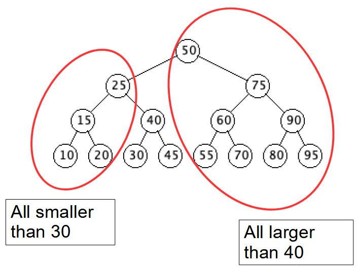
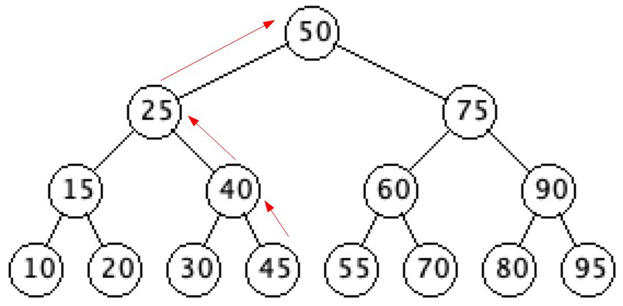
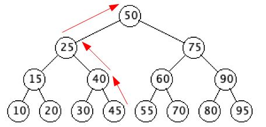
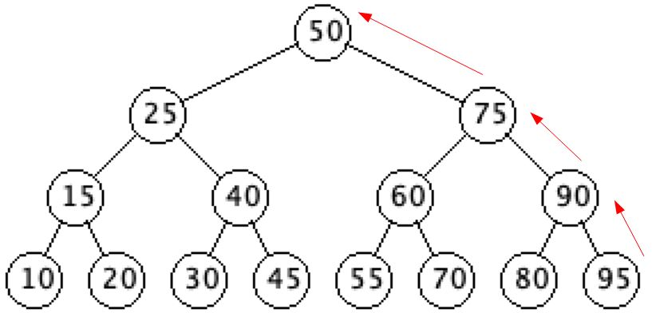
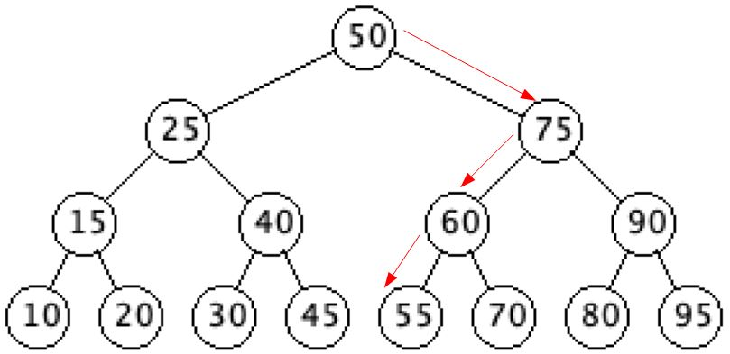

# Successor

`getSuccessor(Node x)`

This will return the node having the ***smallest key value that is greater than*** the specified node's key.
- In other words, it will return the node whose key is the ***least upper bound*** of the specified node's key.

**Note:** The node with the largest key value has a null successor.

## Implementation

- The successor function returns the "next" node in the tree, that is, the Node with the smallest key that is greater than the Node's key value
  - The basic idea is
     - If the Node has a right child, then return the minimum Node of the right subtree (we already saw `getMin`)
     - If the Node does not have a right child, then return the first ancestor of `x` in which `x` is in the Node's left subtree
        - This will be the first Node that has a key greater than `x`'s

``` java
getSuccessor(Node x)
    if(x.getRight() != null) return getMin(x.getRight())
    y = x.getParent()
    while((y != null) and (x == y.getRight()))
        x = y
        y = y.getParent()
    return y
```

### Explanation

- So, how do we know this works, there are two cases
  - `x` has a right child or right subtree
  - `x` does not have a right child or right subtree
- If `x` has a right child, then the Node in `x`'s right subtree having the smallest key, definitely has a key value greater than `x`'s
  - But could `x`'s successor be above it?
  - Everything above and to the left of `x` is smaller than `x`, so they can't be `x`'s successor
  - Everything above and to the right of `x` is larger than `x`, and everything in the subtree rooted at `x` is smaller than everything above and to the right of `x`, so they are all larger than all of the Nodes in the subtree rooted at `x`
  - So, if `x` has a right child, `getMin(x.getRight())` will give us `x`'s successor
     - This is not a proof


- If `x` doesn't have a right child, then we need to find an ancestor of `x` that is larger than `x`
- Any ancestor of `x` above and to the left of it will be smaller, so they can't be `x`'s successor
- Any ancestor above and to the right of `x` will be larger than `x`, so we need to get the smallest of those
  - As we trace back through `x`'s ancestors, the first one that has `x` in it's left subtree is larger than `x`
  - Everything above and to the left of that is smaller than `x`
  - Everything above and to the right of that is larger than the Node which is larger than `x`
    - This is not a proof
- Successor of 30
  - The first ancestor of 30 in which 30 is in the left subtree is 40
  - Everything above and to the left of 40 is smaller than 30
  - Everything above and to the right of 40 is larger than 40



  - The first ancestor of 45 in which 45 is in the left subtree is 50



- Trace of successor of 45
  - First pass of while loop
    - x = 45 (right child of y)
    - y = 40
  - Second pass of while loop
    - x = 40 (right child of y)
    - y = 25
  - Third pass of while loop
    - x = 25 (left child of y)
    - y = 50
  - Exit while loop and return y = 50



- Successor of 95
  - Since 95 is the max Node, the while loop will exit when x becomes the root and y becomes null



- Successor of 50
  - Since 50 has a right child, we simple return the min of it's right subtree


