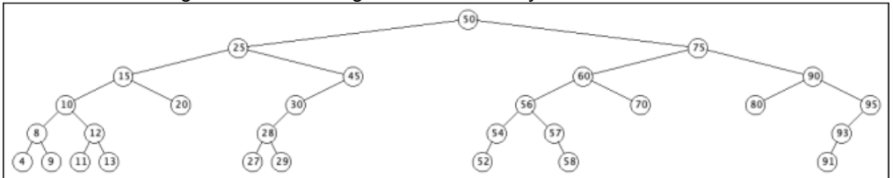
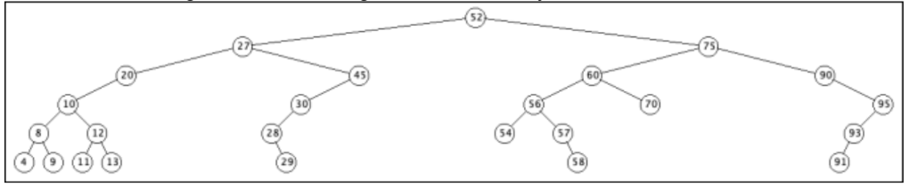

# Example 2

Here is an initially empty tree after adding keys: 
 - 50 25 75 15 40 60 90 10 20 30 45 55 70 80 95 8 12 28 4 9 11 13 27 29 54 57 52 56 58 93 91

Here is the resulting tree after deleting the Node with key 55:

Here is the resulting tree after deleting the Node with key 40:

Here is the resulting tree after deleting the Node with key 15:

Here is the resulting tree after deleting the Node with key 25:

Here is the resulting tree after deleting the Node with key 80:

Here is the resulting tree after deleting the Node with key 50:

