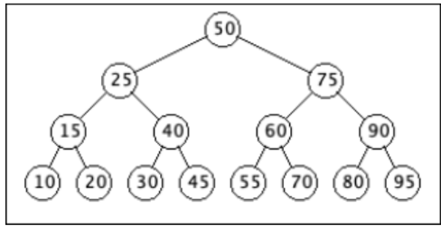
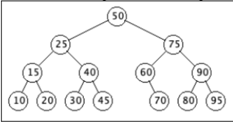
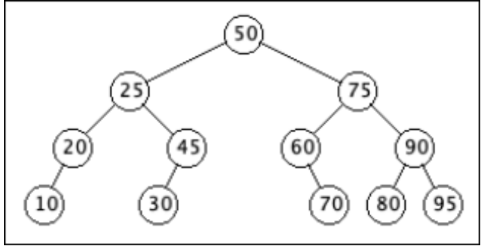
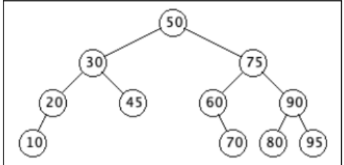
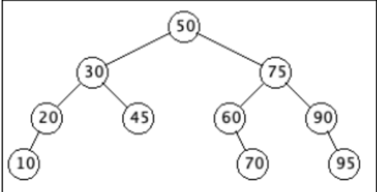

# Example 3 

## A smaller example involving deletion

Here's a smaller example of a BST that we delete the same nodes from. We start with the tree with keys added in the following order:
- 50 25 75 15 40 60 90 10 20 30 45 55 70 80 95

Here is the resulting tree after deleting the Node with key 55:

Here is the resulting tree after deleting the Node with key 40:

Here is the resulting tree after deleting the Node with key 15:

Here is the resulting tree after deleting the Node with key 25:

Here is the resulting tree after deleting the Node with key 80:

Here is the resulting tree after deleting the Node with key 50:

