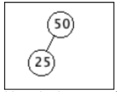
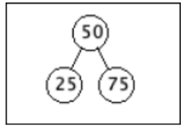
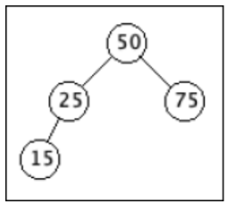
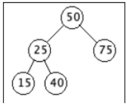

# Example 1

Here is an initially empty tree after adding key 50:

Here is the tree after adding key 25:

Here is the tree after adding key 75:

Here is the tree after adding key 15:

Here is the tree after adding key 40:

